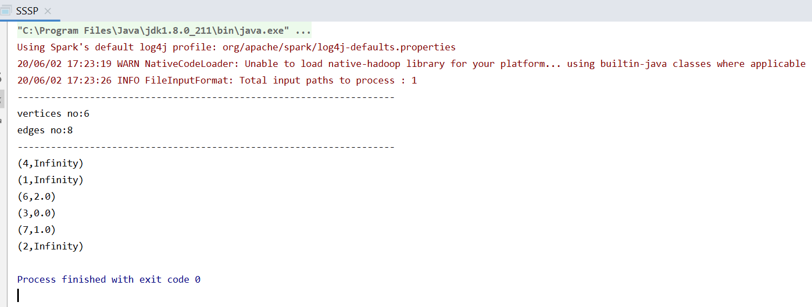
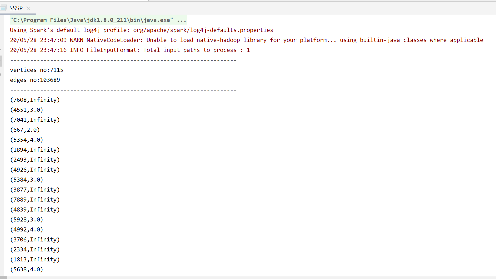
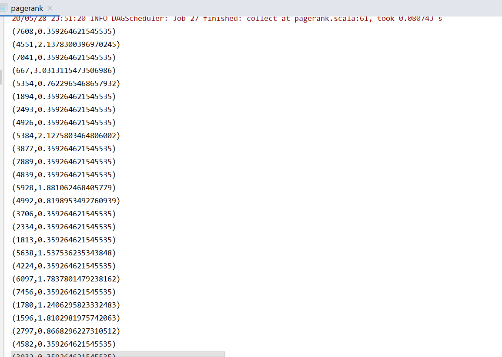
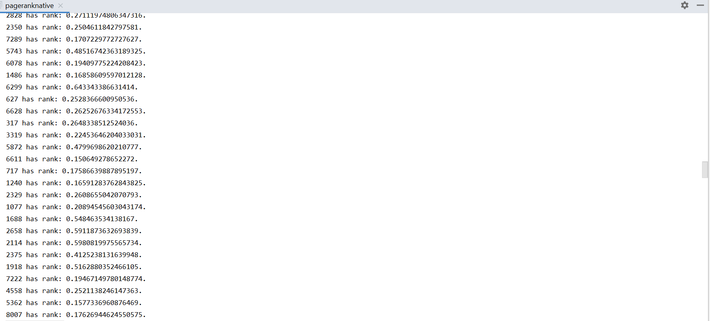
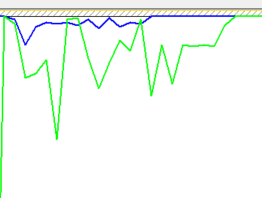
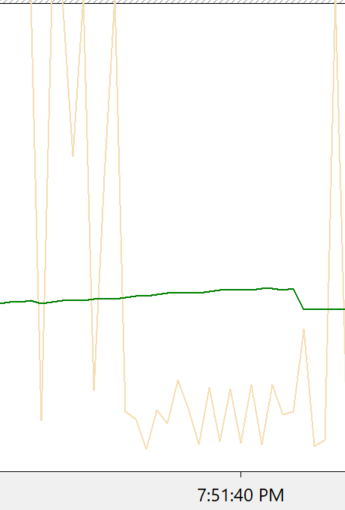
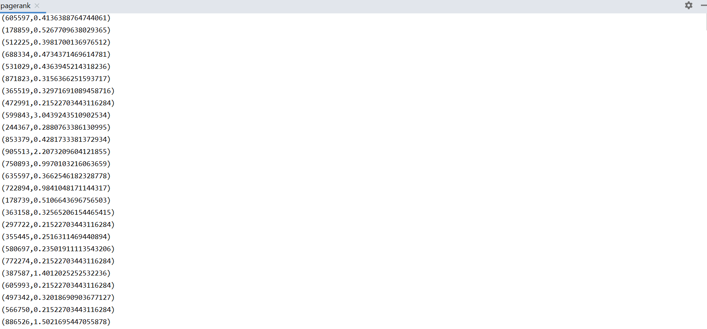
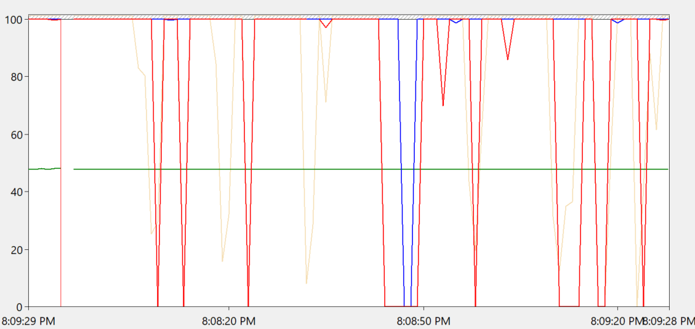
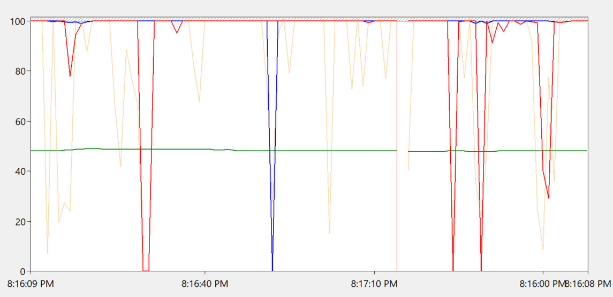
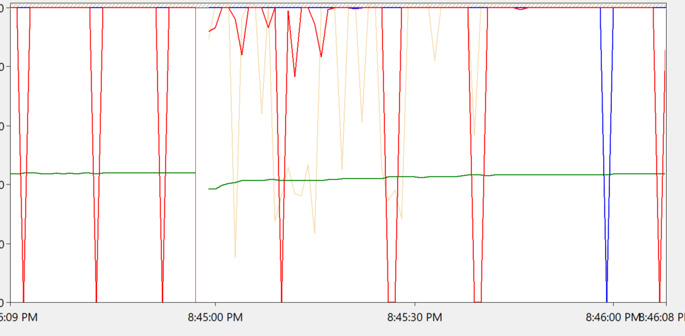

# 计算机体系结构课程实验报告

*Meng Yit Koh 517030990022*

## 实验目的
1. 学习并行计算引擎Spark，了解编程语言Scala和编程环境IDEA。
2. 学习使用开源图计算平台GraphX，了解Pagerank算法的实现流程与优化方式。
3. 练习测量GraphX平台下的内存/缓存数据分析，如内存使用率等。

## 实验 1

graphX API练习

### 流程

1. 首先创建一个SparkSession。由于是单机模式，所以要加个```.config("spark.master", "local")```参数。
2. 使用```GraphLoader.edgeListFile```读取硬盘数据文件，并生成节点图。
3. 使用```graph.mapVertices```给每条边赋除值。这里我们会为每条边赋最大值，表示原始状态下除了自己节点外的每个节点都是不连通的。
4. 使用```initialGraph.pregel```API为每个数据文件里的表达式做map-reduce。Scala里我们可以使用```Iterator```完成这个操作。
5. 显示结果。命令行上显示使用```println(sssp.vertices.collect.mkString("\n"))```，文件形式保存使用```sssp.vertices.map(v => v._1+" "+v._2).saveAsTextFile("path")```

### 结果

计算了自己创建的简单followers.txt测试文件



## 实验 2

使用SSSP和PageRank处理Wikipedia图并测量内存使用率和cache命中率等内存参数

### 流程

1. 实验2的pagerank算法可以使用官方教程实现。具体实现步骤可以参考提交代码里的pagerank.scala。
    - 官方教程使用了```graph.pageRank(0.0001).vertices```内部API实现了该算法，非常简单。
    - 随后使用了```users.join(ranks).map```完成用户和节点映射，再显示出来。由于Wiki数据库并没有用户名称，故不需要执行该映射操作。
2. 由于不知这样简单调用API是否满足实验要求。我自己也根据算法原理自己重新实现了一次。具体代码可以参阅pageranknative.scala。
    - 读取文件后首先使用了```lines.map```执行map操作。并把结果使用```.groupByKey().cache()```执行reduce操作，存储到内存里。这是为了保证性能。
    - 接着使用PageRank算法一步一步的在循环里实现100次。这里的100次是根据本人电脑性能设计的。太少会导致结果不正确，太多则会计算太久。经过调试最终定在100次循环。当然我也提供了更改方式。只要在调用函数的时候添加arg就可以使用自定义循环次数。
    - 最后显示结果。和实验1一样可以选择本地显示还是储存到磁盘里。

### 结果

SSSP: 



PageRank:

使用官方教程计算结果：



使用自己实现的程序计算结果：



可见两种算法计算的最终结果有一些差别，但是基本能够将各个节点的权重表示出来。

缓存状态测试：



*绿色是缓存命中率，蓝色是数据缓存命中率*

内存状态测试：



*绿色是内存使用率，黄色是内存命中率。*

可见在执行Wiki-Vote PageRank算法时的缓存基本是能够命中的。命中率高达90-100%。内存使用也不成为性能瓶颈，基本不会达到上限。

## 实验 3

处理Google图并测量内存使用率和cache命中率等内存参数

### 流程
 
1. 实验流程基本和实验2一致。本次实验是对更大的数据量进行计算。据我了解，新版本的Spark默认会对过大量的源数据文件进行切割。这是对程序员透明的。我们可以在log里看到```20/05/29 20:19:18 INFO HadoopRDD: Input split: file:/C:/Users/kmyko/Desktop/computer architecture/lab/src/test/web-Google.txt:67108864+8271251```这种信息表明数据分割已被使用。
2. 但是当我们在使用```GraphLoader.edgeListFile```生成节点时，GraphX不会进行分割，只会对已经被分割的数据集进行计算生成节点。这里导致我们运行时异常缓慢。
3. 我们可以使用```.partitionBy(PartitionStrategy.XXX)```这个函数定义我们生成节点时要使用的分割算法。官方选择有RandomVertexCut，1D，2D等等。程序员也可以自己写。
    - RandomVertexCut是一个随机的分割算法。这个实验我将会使用这个算法。
    - 1D适用于频率，性能较好的处理器核心上。因为GraphX会对每个节点进行哈希值的计算。这里会有一定的开销。但是总体公平性比较有保证。最终计算时间可能比较欢快。
    - 2D适用于核数较多的处理器上。具体算法就是分布节点于N*N矩阵上进行计算。有点类似GPU渲染时的运算。我想应该是适用于GPU处理的算法吧。
 
### 结果

计算结果：

SSSP: 


Pagerank:



无分割算法性能图：




*红色是缓存命中率，蓝色是数据缓存命中率，绿色是内存使用率，黄色是内存命中率。*

使用RandomVertexCut分割算法性能图：



*红色是缓存命中率，蓝色是数据缓存命中率，绿色是内存使用率，黄色是内存命中率。*

我们可以看出：

- 使用了分割算法的缓存命中率（红色和蓝色线）整体曲线比较平滑但是不会有太大的差别。
- 内存使用率（绿色线）则会有较大能见的差别。分割后的曲线明显有抖动。也就表示内存的使用率一直因为数据的读取发生变化。整体往上增长表示内存使用较有效率。
- 内存命中率（黄色线）也有明显差别。没使用分割的黄线明显抖动得厉害，一直往0%和100%来回抖动，表示命中率不稳定。而分割了的黄线除了刚运行时，其余时候都稳定往100%靠拢，表示内存命中率稳定。我想应该和locality有关。

## 实验难题

- windows上的perfmon有点混淆，并且没办法记录单一进程的数据，只能记录系统全局的数据。
    - 反复进行实验，取平均值。
- 网络上的pagerank教程都是使用现成函数直接生成。缺少算法教导。
    - 根据paper简要的写了一个循环计算的pagerank算法，准确性不高。
- 读取文件的overhead对perfmon的影响太大，且无法屏蔽。
    - intellij植入断点，在把文件完全读进内存后，继续执行才开始记录perfmon上的数据。
- Locality问题导致每次执行的数据都很不相同（越来越快）。
    - 实验2和实验3交叉执行，取平均值，确保最小影响。

## 实验总结

- SSSP的计算可以用Pregel循环计算得出结果。
- 官方教程实现了PageRank算法。我们只需要直接调用即可。我自己用原理实现的算法由于优化不好导致计算缓慢，而且结果也有一些很小的差异（这个差异应该可以通过更多循环弥补）。
- 使用了分割算法生成计算大量数据的节点时，会对内存命中率有较好的影响，导致最终计算比较快。

## 感谢

感谢学校，老师，助教及同学们的帮助。本次实验让我学习了Spark的使用，让我获益良多。